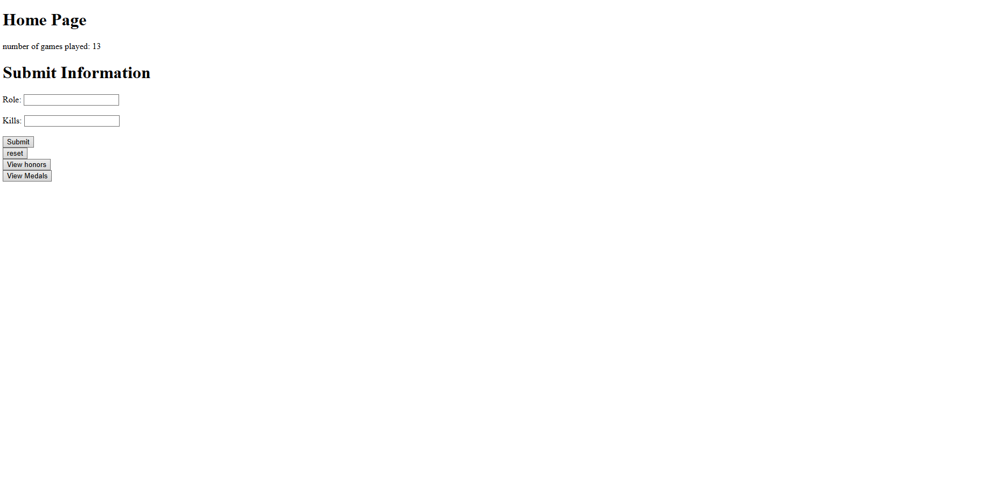
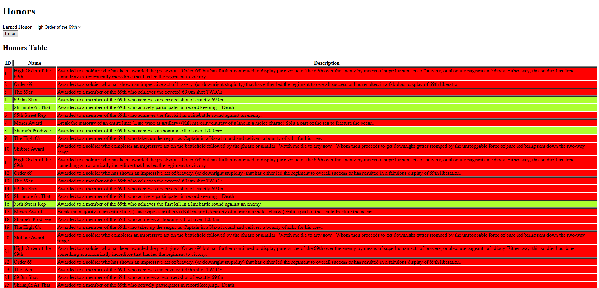
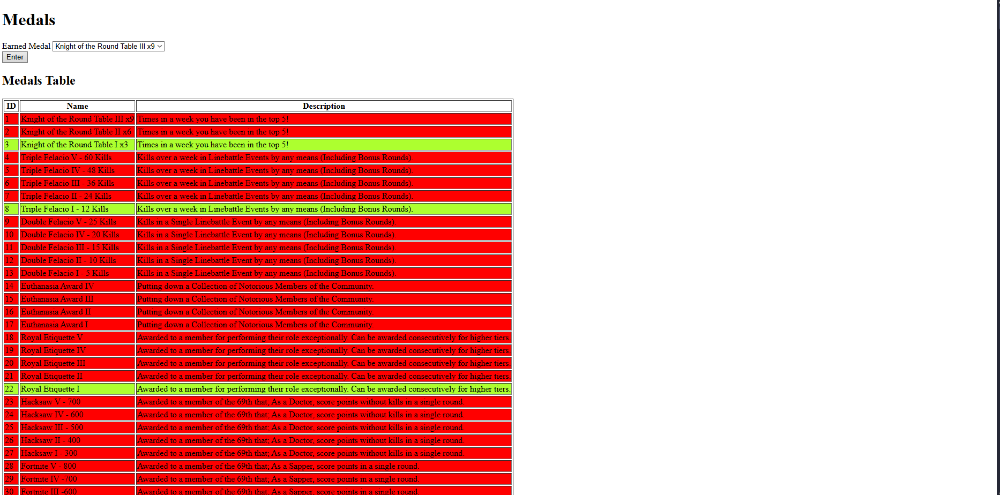

# Holdfast Stat Tracker

A simple web application to track and display player statistics, honors, and medals for the 69th Regiment in Holdfast.

## Features

- Submit and track player roles and kills.
- View the number of games played.
- View honors and medals awarded to players.
- Reset the database from the web interface.

## Screenshots

### Home Page



### Honors Page



### Medals Page



## Project Structure

- `main.py` - Main application logic (likely Flask app).
- `database/` - Contains the SQLite database file.
- `templates/` - HTML templates for the web interface.
- `medals.txt` - List and descriptions of medals.
- `honors.txt` - List and descriptions of honors.

## Customizing Medals and Honors

You can easily change the medals and honors to suit your needs:

- **`medals.txt`** and **`honors.txt`** are plain text files.
- The structure is as follows:
  - The first non-empty line is a description for a group of medals/honors.
  - Every line after that (until the next empty line) is a medal/honor that uses that description.
  - When an empty line is encountered, the next non-empty line is treated as a new description, and the process repeats.
- Example:
  ```
  Description for this group
  Medal 1
  Medal 2

  Another group description
  Medal 3
  Medal 4
  ```
- Edit these files to add, remove, or modify medals and honors as you wish.  
- Changes will be reflected in the web interface automatically.

## Getting Started

### Prerequisites

- Python 3.x
- Flask (`pip install flask`)
- SQLite (included with Python)

### Running the App

1. Make sure you are in the project directory:
    ```sh
    cd holdfast-stat-tracker
    ```

2. Run the application:
    ```sh
    python main.py
    ```

3. Open your browser and go to `http://127.0.0.1:5000/`.

### Usage

- Submit your role and kills using the form on the home page.
- Use the navigation buttons to view honors and medals.
- Use the reset button to clear the database.

## License

This project is licensed under the MIT License.

---

<sub>**Note:** This project was made for personal use, but it can be used as an example of how SQLite and Flask can be implemented in a project. You are encouraged to modify the medals and honors to fit your own needs.</sub>